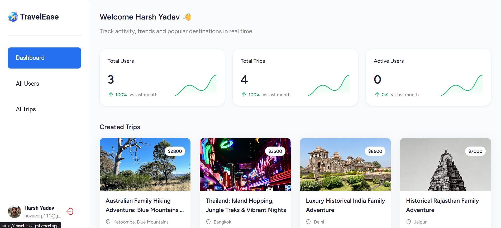
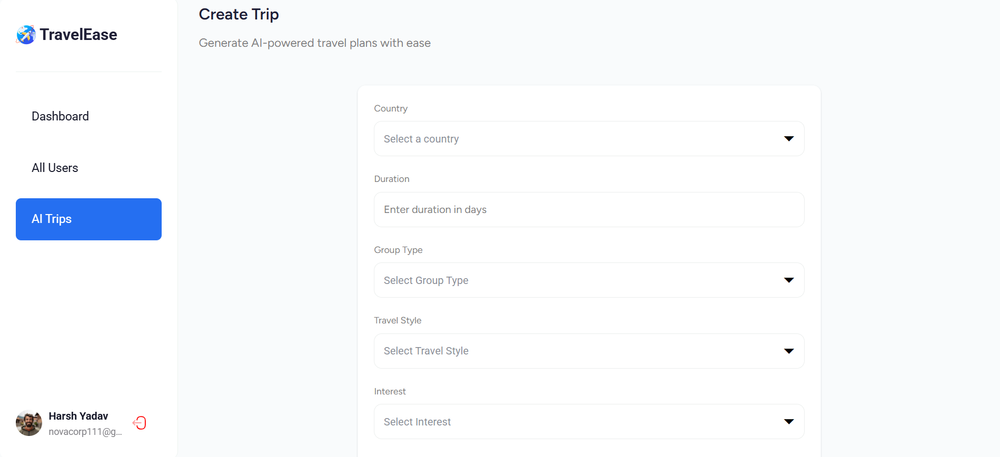
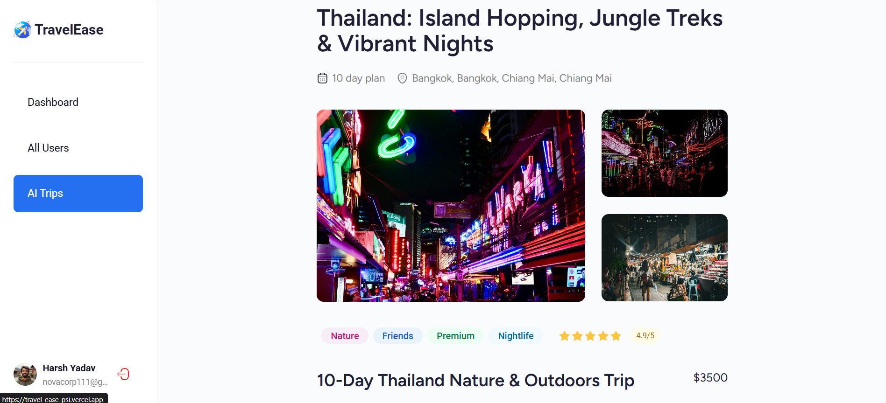
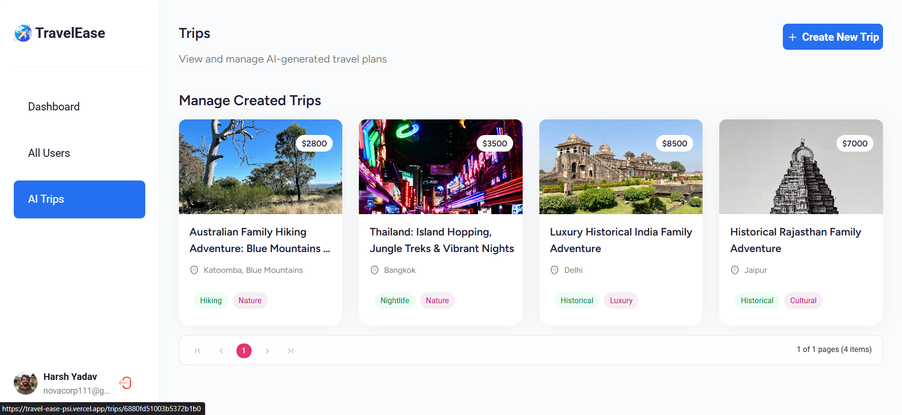

# TravelEase 🌍✈️

An AI-powered travel planning platform that generates personalized travel itineraries using Google's Gemini AI. Built with React Router 7, TypeScript, and Appwrite.

## 📸 Screenshots

### Dashboard


### Trip Creation


### Trip Details


### All Trips


---

## ✨ Features

- **AI Trip Generation**: Personalized itineraries using Google Gemini AI
- **User Authentication**: Google OAuth with role-based access
- **Admin Dashboard**: Analytics, user management, and trip statistics
- **Interactive Maps**: World map integration for destination selection
- **Responsive Design**: Mobile-first approach with modern UI

## 🛠️ Tech Stack

- **React Router 7** & **TypeScript**
- **Tailwind CSS** & **Syncfusion Components** 
- **Appwrite** (Backend)
- **Google Gemini AI** (Trip generation)
- **Unsplash API** (Images)

## 🚀 Getting Started

### Environment Variables

```env
# Appwrite
VITE_APPWRITE_API_ENDPOINT=https://cloud.appwrite.io/v1
VITE_APPWRITE_PROJECT_ID=your_project_id
VITE_APPWRITE_DATABASE_ID=your_database_id
VITE_APPWRITE_USERS_ID=your_users_collection_id
VITE_APPWRITE_TRIPS_ID=your_trips_collection_id

# APIs
GEMINI_API_KEY=your_gemini_api_key
UNSPLASH_ACCESS_KEY=your_unsplash_access_key
```

### Installation

```bash
# Clone repository
git clone https://github.com/yourusername/travelease.git
cd travelease

# Install dependencies
npm install

# Start development
npm run dev

# Build for production
npm run build
```

## 📁 Project Structure

```
app/
├── appwrite/           # Backend services
├── routes/             # React Router routes
│   ├── admin/          # Admin panel
│   ├── root/           # Public routes
│   └── api/            # API endpoints
components/             # UI components
lib/                    # Utilities
```

## 🤝 Contributing

1. Fork the repository
2. Create feature branch (`git checkout -b feature/name`)
3. Commit changes (`git commit -m 'Add feature'`)
4. Create Pull Request

## 📄 License

MIT License
